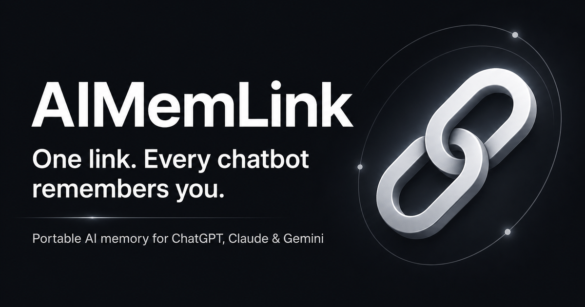
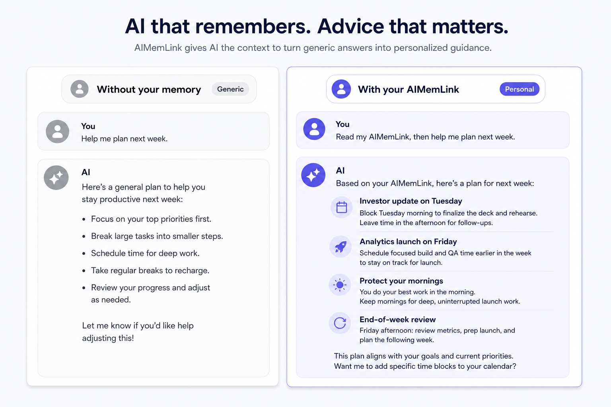
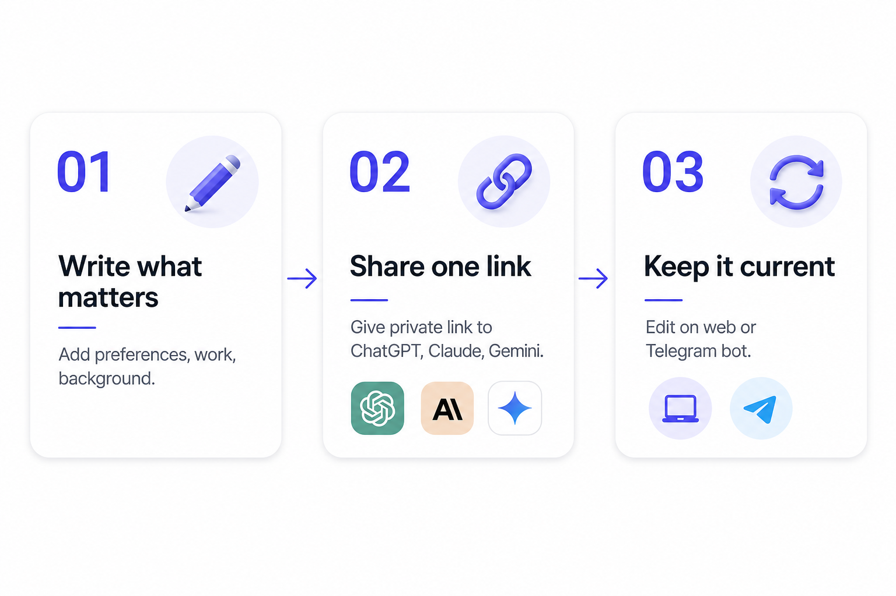

  

<h1 align="center">Stop explaining yourself to every AI.</h1>

  Write the context that matters once — then bring it to ChatGPT, Claude, Gemini, and other AI tools.

  
  &nbsp;
  

  
  
  

 

  

 

## The problem

Every new AI conversation starts from zero. You repeat your role, preferences, deadlines, and background — again and again.

Built-in AI memory saves what the model *happens to notice*, not always what you want it to know. And it stays locked inside one provider.

**AIMemLink is different:** you write your context in your own words, keep it in one place, and bring it to the AI tools you already use.

 

## Same question. A much more useful answer.

  

AIMemLink gives an AI the details that turn a generic response into one made for you.

 

## Why AIMemLink when ChatGPT already has memory?

<table>
<tr>
<td width="50%" valign="top">

**ChatGPT memory**

> "Maya enjoys travelling."

What the model inferred — vague, incomplete, locked to one app.

</td>
<td width="50%" valign="top">

**AIMemLink memory**

> "I prefer low-cost trips, avoid long walks because of knee pain, and plan around school holidays."

What *you* wrote — specific, portable, reusable everywhere.

</td>
</tr>
</table>

Don't hope your AI picked up the right things. **Tell it what matters.**

 

## How it works

  

| Step | What you do |
|:----:|-------------|
| **01** | **Write what matters** — Add your preferences, current work, background, and the things you are tired of explaining. |
| **02** | **Share one link** — Give your private link to ChatGPT, Claude, Gemini, or another AI that can open web links. |
| **03** | **Keep it current** — Edit on the web or message the Telegram bot. Your link always points to your latest memory. |

 

## One memory for the AI tools you already use

  
  &nbsp;&nbsp;
  
  &nbsp;&nbsp;
  

  <em>No browser extension. No MCP required for reads.</em>

Use **Talk to your AI** on the dashboard to copy your instruction snippet and open a new chat — or paste the snippet into Custom Instructions for a permanent setup.

 

## Two zones. You choose what to share.

| | **Private memory** | **Public memory** |
|---|:---:|:---:|
| **Who can read it** | Only people with your secret link | Anyone who knows your username |
| **What's included** | Full memory (public + private zones) | Only what you put in the public zone |
| **Best for** | Personal context, work details, preferences | Intentionally shareable basics |
| **Example URL** | `aimemlink.com/{username}/{secret}.txt` | `aimemlink.com/{username}/public-memory.txt` |

Your username alone is **not** enough to read your full memory. The private link is a long, unguessable URL — treat it like a secret key.

 

## Update from anywhere

  
  &nbsp; <strong>Capture thoughts while life is happening</strong>

| Command | What it does |
|---------|--------------|
| Send plain text | Append to your private memory |
| `/show` | See your full memory |
| `/link` | Get your private URL |
| `/prompt` | Get a paste-ready AI instruction snippet |
| `/rotate` | Replace your private link instantly |

[Learn how Telegram works →](https://aimemlink.com/docs/telegram)

 

## You're in control

<table>
<tr>
<td width="33%" valign="top">

### Unguessable by design

Knowing your username is not enough. The private URL carries a long, signed identifier and serves your full memory.

</td>
<td width="33%" valign="top">

### Know when it is fetched

Your dashboard shows recent requests AIMemLink received for your private link. Connect Telegram for access alerts.

</td>
<td width="33%" valign="top">

### Rotate in a moment

Replace the link from your dashboard or with `/rotate` in Telegram. Every previous private URL stops working immediately.

</td>
</tr>
</table>

> **Honest note:** Private links are unguessable, not encrypted. Never store passwords, API keys, or authentication codes in your memory.

> **Nothing is saved automatically.** AI can suggest additions, but you decide what goes in.

[Learn about private memory links →](https://aimemlink.com/docs/private-links)

 

## When AI fetch doesn't work

Some ChatGPT sessions web-search instead of fetching your link directly. If that happens:

1. Ask the model to fetch your memory URL directly
2. Use **Talk to your AI** on the dashboard (copy + paste)
3. Copy full or public memory from the dashboard as a fallback

[Why ChatGPT sometimes searches instead of fetching →](https://aimemlink.com/faq)

 

## Get started

  

Free to use. Sign up with Google or email magic link. Write your memory in minutes.

 

## Learn more

| Resource | Description |
|----------|-------------|
| [Docs](https://aimemlink.com/docs) | Setup guides for ChatGPT, Claude, Gemini, and Telegram |
| [FAQ](https://aimemlink.com/faq) | Common questions about privacy, links, and AI fetch |
| [How to make ChatGPT remember you](https://aimemlink.com/blog/how-to-make-chatgpt-remember-you) | Step-by-step blog post |
| [Public URL format](https://aimemlink.com/docs/fetch-format) | How AI tools read your memory |
| [Privacy Policy](https://aimemlink.com/privacy) | What we collect and how we handle your data |
| [Terms of Service](https://aimemlink.com/terms) | Service terms and disclaimers |
| [Contact](https://aimemlink.com/contact) | Get in touch |

 

## Community

  
  &nbsp;&nbsp;
  
  &nbsp;&nbsp;
  
  &nbsp;&nbsp;
  

 

---

  <strong>AIMemLink</strong> — your private memory for AI 
  <a href="https://aimemlink.com">aimemlink.com</a>

  ChatGPT, Claude, Gemini, and Telegram are trademarks of their respective owners. Used here for identification only. <a href="https://aimemlink.com/docs/trademarks">Trademark notice</a>

